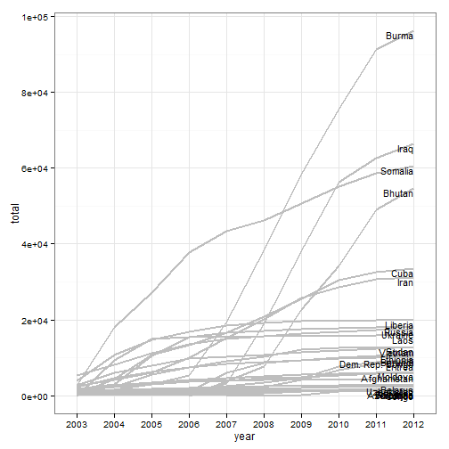
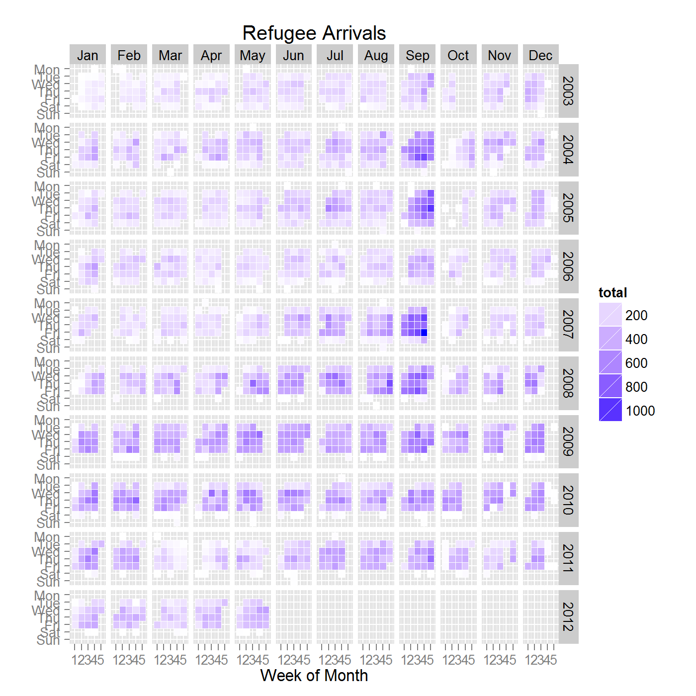

# Disease Notification Analysis 
- DNA
- John Painter
- June  25, 2012
================

# What is DNA
- a system for easily viewing and analyzing EDN
- EDN -> ADN -> DNA
- Reduces complex database to drag-and-drop pivot table

# Where Does DNA Fit In?


# DNA includes data from:
 - AIS (1997--2000)
 - IMP (2000--2009)
 - EDN (2007--present)

# How to access DNA
* via SQL-Server
* Excel
 ** make connection
 * drag-and-drop
 * set it and forget it
 * update when needed

# Where to Find DNA Documentation?


# Which Value?
- 'All' counts all records from AIS, IMP, EDN
- For AIS and IMP, limitted data 
- - Only arrival date, TB class, country of birth 
- vw EDN for counts of EDN records
 - - Every field in DS forms available
- WRAPS for counts of DOS refugee records
 -- Nationality, ethnicity, language, marital status, relationship

# DNA dimensions
- dimensions like a variable, but may be cascading
- flat dimension
- Cascading dimension

# Date ranges
- Fiscal or calendar year
- Month of year (May, 2012) or calendar month (May)
- Same for quarter, week, and day

# Table showing No. Records for 3 Systems

# Table showing arrivals by Q station

# Table showing arrival by Visa Type and Class B TB


# Sample chunks....


```
## Loading required package: ggplot2
```


```
## Loading required package: directlabels
```


```
## Loading required package: grid
```

 


# Refugee Arrivals by Day


```r
ggplot(dat, aes(monthweek, weekdayf, fill = total)) + geom_tile(colour = "white") + 
    facet_grid(year ~ monthf) + scale_fill_continuous(low = "white", high = "blue", 
    na.value = "white") + # scale_file_manual() scale_fill_gradient( low='white', high='blue' ) +
opts(title = "Refugee Arrivals") + xlab("Week of Month") + ylab("")
```

 


- 2003--2008, strong seasonal pattern
- - 1,179 arrived September27, 2008
- Since 2007, fewer extreme days
- then mean number of refugee arrivals is `242.4646`

# Slidify
pandoc -s -S -i -t slidy --mathjax C:\Users\bzp3\Desktop\DNA\DNA-Presentation.md -o C:\Users\bzp3\Desktop\DNA\DNA-Presentation-slildy.html
